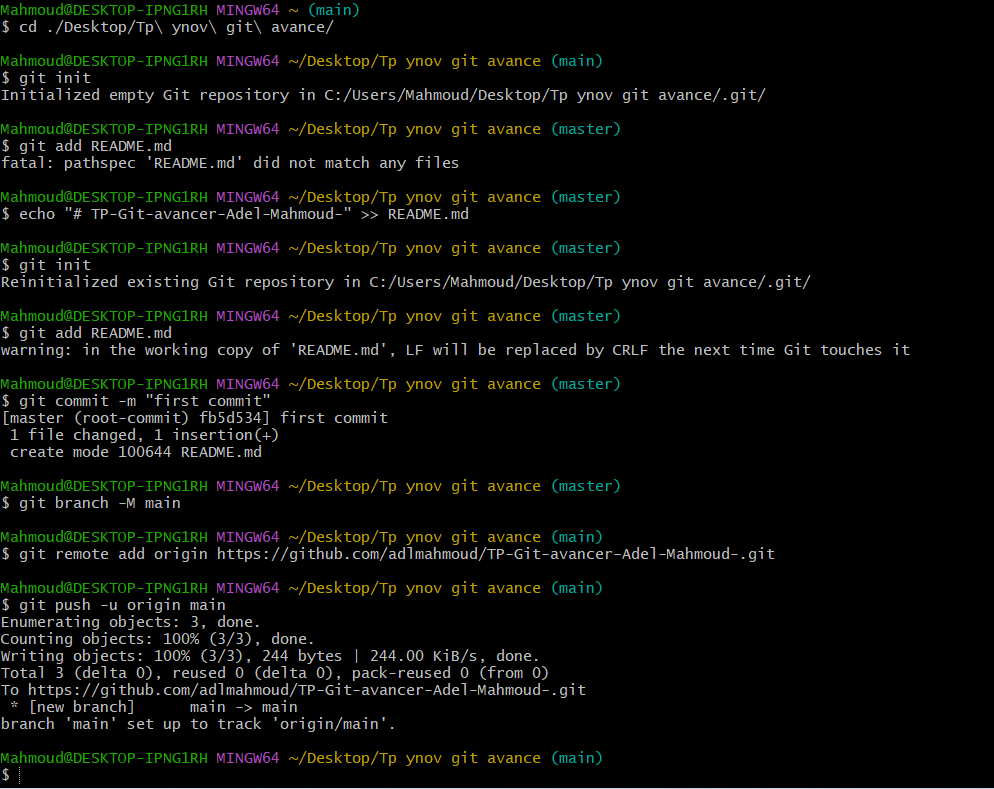
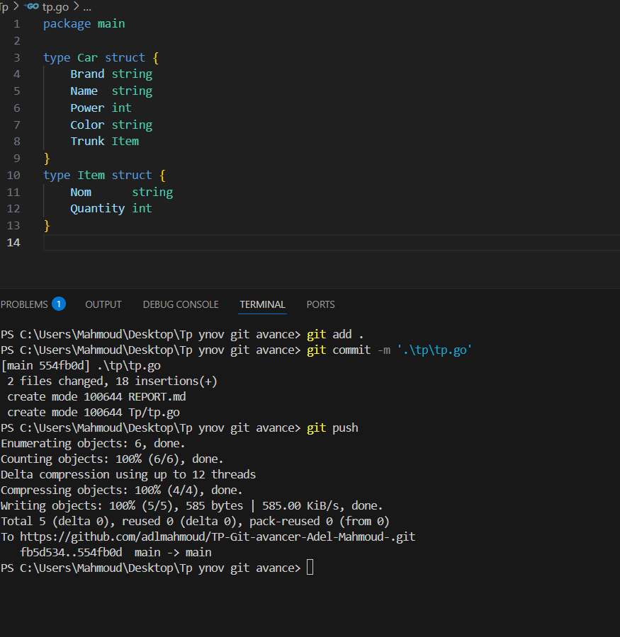

# Rapport Git - Projet

## Partie I - Initialisation et configuration

### Étape 1 : Créer un dépôt Git local et l’initialiser (`git init`)

1. En a utiliser "git init" pour initialise un nouveau repository Git dans le dossier actuel.

### Étape 2 : Ajouter et valider plusieurs versions de fichiers (git add, git commit).

  La commande git add . envoie le code de Working Directory a Staging Area ensuite en utilise git commite pour crées un instantané local de ces fichiers avec un message, il seras enregistrer sur le depot local.

### Étape 3 : Utiliser git status, git diff, git log pour suivre l’évolution.
 

