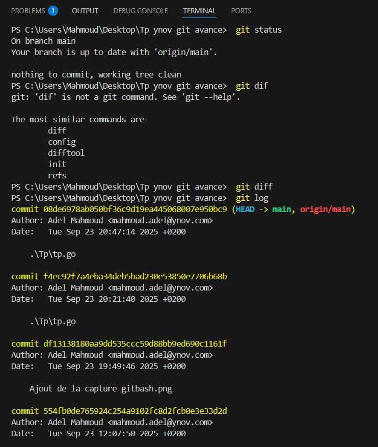
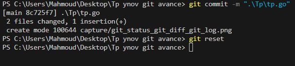
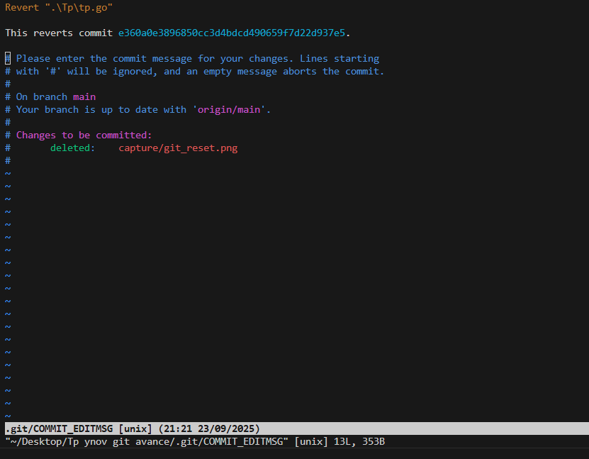
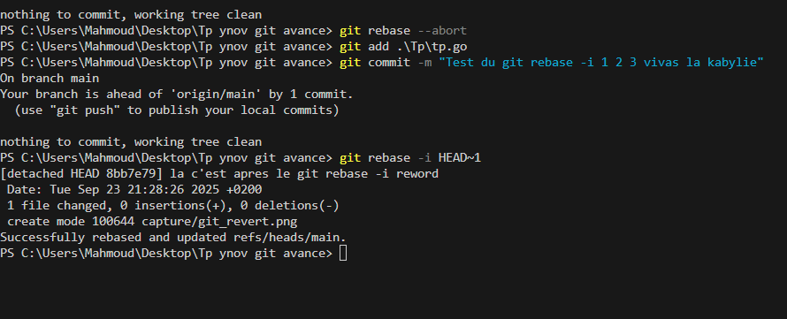
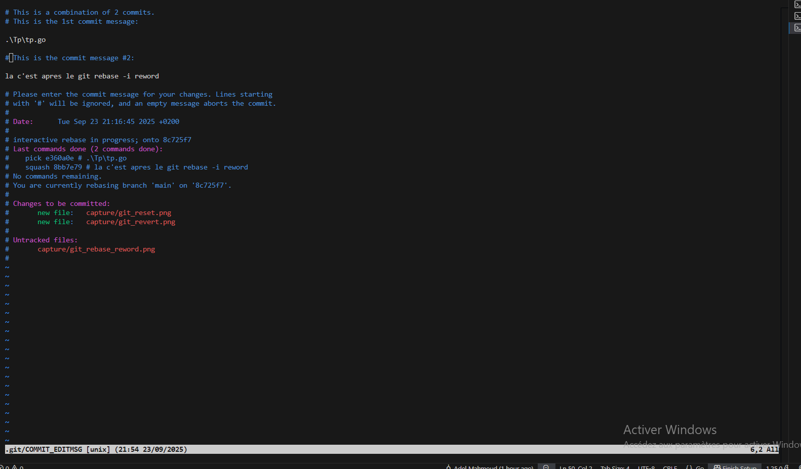
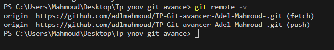
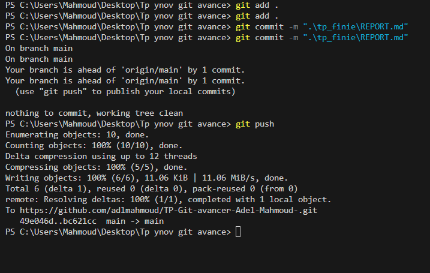

# Rapport Git - Projet

## Partie I - Initialisation et configuration

### Étape 1 : Créer un dépôt Git local et l’initialiser (`git init`):

1. En a utiliser "git init" pour initialise un nouveau repository Git dans le dossier actuel.

### Étape 2 : Ajouter et valider plusieurs versions de fichiers (git add, git commit):

  La commande git add . envoie le code de Working Directory a Staging Area ensuite en utilise git commite pour crées un instantané local de ces fichiers avec un message, il seras enregistrer sur le depot local.

### Étape 3 : Utiliser git status, git diff, git log pour suivre l’évolution:
 
 1. Git status nous permet de verifier si le dépôt local est à jour avec le dépôt distant,quels fichiers ont été modifiés mais pas encore ajoutés à la Staging Area,quels fichiers sont prêts à être commités et quels fichiers ne sont pas suivis par Git.
 2. Git diff n’affiche rien si la Staging Area est vide. Après avoir modifié des fichiers, git diff montre toutes les modifications non encore ajoutées à la Staging Area.
 3. Git log nous montre l'historique des commites du depot local.

### Étape 4 :Tester l’annulation de changements (git reset, git revert):
 
1. Git reset sert a nettoyer la Staging Area, apres le commit.

 

2. Git revert, crée un nouveau commit qui inverse les changements du commit ciblé.

### Étape 5 :Nettoyer l’historique avec git rebase -i (reword, squash):

1. Le git rebase reword nous permet de modifier le text du commit.

2. Le squash en Git sert à fusionner deux (ou plusieurs) commits consécutifs en un seul.

### Étape 6 :Publier le projet sur un dépôt GitHub personnel (git remote add, git push):

